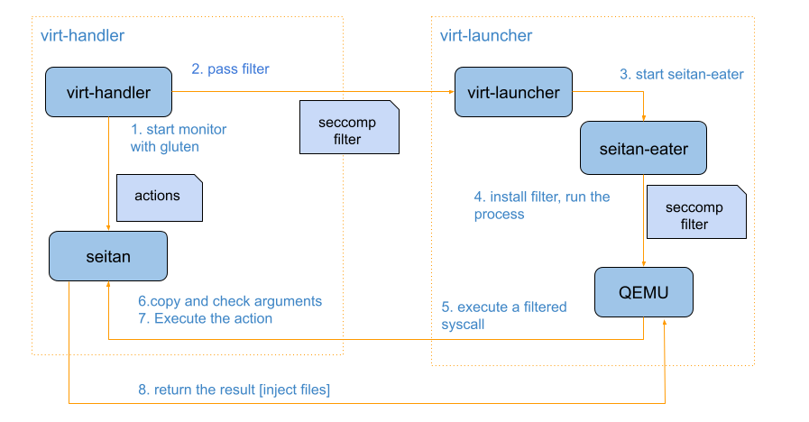
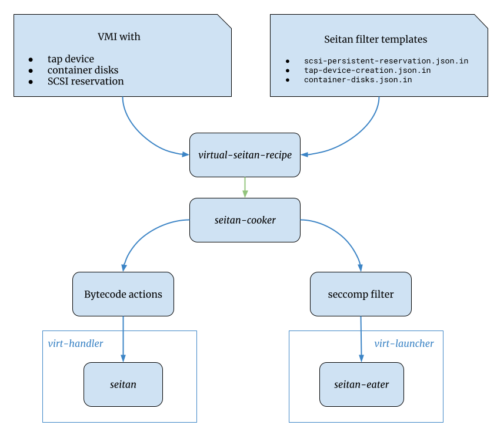

# Unified control of privileged resources access and operations with seccomp notifiers in KubeVirt

Authors: Alice Frosi, Stefano Brivio

## Overview

Processes running in a KubeVirt unprivileged context routinely need to perform
several operations with elevated privileges, extra capabilities, and access to
external pod resources.

This led to the implementation of several workaround mechanisms covering, for
instance:

* Access to _container disks_ and _hotplugged volumes_
* Creation of tap devices
* Connecting QEMU to privileged daemons
* Reduction of capabilities granted to _virt-launcher_ container

This proposal outlines a mechanism to **unify access to privileged resources**.
BPF programs filter system calls and notify a userspace component, which
performs appropriate actions as a result.

See also, in more detail:

* [Implementation Details](./seitan-tree.md)
* [Security Aspects](./security-aspect-seitan.md)

### Motivation

Today, _virt-handler_ needs to implement several operations to create resources
needed by _virt-launcher_ requiring elevated privileges.  These operations need:

* namespace manipulation from _virt-handler_ (e.g mount and network namespace)
* executing privileged processes inside the _virt-launcher_ namespace
* explicit synchronization between _virt-launcher_ and _virt-handler_ when the
  resources are available

#### Disk access

Container disks and hotplugged volumes are storage options not natively
supported by Kubernetes. KubeVirt mounts the directories of those volumes inside
the _virt-launcher_ filesystem container. However, these mount operations aren’t
transparent to Kubernetes, and this can cause conflicts during the clean-up of
the virt-launcher pod.


#### Tap device creation

_Virt-handler_ executes the _ioctl_ syscall running a privileged process inside
the network namespace of _virt-launcher_.


#### Connecting QEMU to privileged daemons

QEMU is more and more modularized and certain functionalities are delegated to
separate processes. An example is the SCSI persistent reservation, where a
privileged daemon, the _pr-helper_, executes the SCSI _ioctls_ on behalf of the
guest.

Connecting processes through UNIX sockets running in two different namespaces
isn’t natively supported in k8s. A possible workaround is mounting the Unix
socket in the client process namespace with the drawbacks already mentioned for
disk access, or the need for a proxy for every connection.


#### Reduction of capabilities granted to virt-launcher

For certain features, QEMU requires additional capabilities, and this conflicts
with the admitted capability of the [Pod Security
Standards](https://kubernetes.io/docs/concepts/security/pod-security-standards/)
of Kubernetes. A concrete example is for running real-time VMs where the [vCPU
scheduler and priority](https://github.com/kubevirt/kubevirt/pull/8750) need to
be changed and requires CAP_SYS_NICE.

There’s currently no unified mechanism to implement this kind of resource access
while providing a consistent level of access control. A declarative approach
appears to be more appropriate compared to imperative approaches with
implementations scattered over several components.


### Goals


* Introduce a generic mechanism to create seccomp filters based on the VM/VMI
  definition and create a seccomp notifier for each VM
* Replace old mechanisms with seccomp filters for:
    1. Tap device creation
    2. SCSI persistent reservation (this mechanism avoids the need for the proxy
proposed in the [email
thread](https://groups.google.com/g/kubevirt-dev/c/AmjvVqlD1Hs))
* Evaluate where this mechanism could be reused

### Non Goals

* We plan to install an additional seccomp filter inside the virt-launcher
  container. Container engines already partially support seccomp filters,
however, they are only used to block or allow certain syscalls. They do not
define actions, therefore this doesn’t require a notifier.

### Definition of Users

This feature is intended for internal usage of KubeVirt and won’t be exposed to
the final users.

### Repositories

* [Kubevirt](https://github.com/kubevirt/kubevirt)
* [Seitan](https://seitan.rocks/seitan/about/)


## Design


### Introduction

The generation, monitoring, and installation of the seccomp filters is performed
by [seitan](https://seitan.rocks/seitan/about/) (_Syscall Expressive
Interpreter, Transformer and Notifier_).

The seitan project comes with 3 components:

* _Seitan_ is the seccomp monitor running on the privileged side. It is
  responsible for
    1. evaluating the arguments of the filtered syscalls
    2. executing the corresponding action
    3. returning the result
* _Seitan-eater_ is the installer of the seccomp filters in the unprivileged
  context (_virt-launcher_)
* _Seitan-cooker_ generates the inputs for _seitan_ and _seitan-eater_ based on
  the _seitan recipe_. The _seitan recipe_ is a JSON input file that lists the
filtered syscalls, their arguments, and the corresponding action for a specific
VMI.


### Integration with KubeVirt

Figure 1 shows the entire deployment and execution of a filtered syscall by
QEMU.



*Figure 1. General flow of a filtered syscall*`


### Seitan recipe examples

The following examples show the corresponding seitan recipe based on the feature
requested by the VMI.


#### Container disks

VMI:
```yaml
  volumes:
  - containerDisk:
      image: registry:5000/kubevirt/cirros-container-disk-demo:devel
    name: containerdisk
```

Seitan recipe:

```json
[
{ "syscall": [ "open" ], "handle":
    [
    {
        "matches": [
        { /* Path inside the container based on the volume name */
            "path":
                "/var/kubevirt-share/container-disks/containerdisk/disk.img",
                "fd":     "@x"
        }],
            "actions": [
            { "call": { "sys":    "open",
                          /* Path solved at runtime */
                          "path":
                              "/var/kubelet/pods/.../container-disks/disk.img",
                          "ret":    "@y" }
            },
            { "inject": { "what": "fd", "new": "@y", "old": "@x" } },
            { "return": 0 }
            ]
    },
    {
        "matches": [ {} ],
        "actions": [ { "continue": "unsafe" } ]
    }
    ]
}
]
```

#### SCSI persistent reservation

VMI:
```yaml
   devices:
      disks:
      - name: mypvcdisk
        lun:
          reservation: true
```

Seitan recipe:

```json
[
{ "syscall": [ "connect" ], "handle":
    [
    { /* qemu-pr-helper and similar */
        "matches": [
        { "mod":    "connect",
            "family": "unix",
            "path":   "/var/run/pr-helper.sock",
            "fd":     "@x" }
        ],
        "actions": [
        { "context": { "netns": "init", "userns": "init" } },
        { "call": { "sys":    "connect",
                      "family": "unix",
                      "path":   "/var/run/pr-helper.sock",
                      "ret":    "@y" }
        },
        { "inject": { "what": "fd", "new": "@y", "old": "@x" } },
        { "return": 0 }
        ]
    },
    {
        /* no reason to block connect(), regardless of arguments */
        "matches": [ {} ],
        "actions": [ { "continue": "unsafe" } ]
    }
    ]
}
]
```

#### Tap device:

VMI:
```yaml
 domain:
    devices:
      interfaces:
        - name: red
          bridge:
```


Seitan recipe:

```json
[
{ "syscall": [ "ioctl" ], "arg2": "u32:TUNSETIFF", "handle":
    [
    { /* "As a hypervisor, I want to create a tap interface" */
        "matches": [
        { "mod": "ioctl", "path": "/dev/net/tun",
            "ifr": { "name": "tap0)", "flags": "IFF_TUN" }
        },
        { "limit": "counter", "scope": "process", "count": 1 }
        ],
        "actions": [
        { "context": { "netns": "init", "userns": "init" } },
        { "call": "ioctl",
            "path": "/dev/net/tun",
            "ret":  "@x",
            "ifr":  { "name": "tap0", "flags": "IFF_TUN" }
        },
        { "return": "@x" }
        ]
    }
    ]
}
]
```

### Generation of seitan recipes

The _seitan filter templates_ generally describe syscalls and action for a
feature. Based on the VMI specification, KubeVirt can compose from the _seitan
templates_ and generate the corresponding _seitan recipe_. For example, the
seitan templates don’t have the real path of the container disks, but this can
be resolved at runtime by _virt-handler_ before generating the _seitan recipe_.



*Figure.2 Generation and installation of the seccomp filter and action bytecode*

Figure 2 shows the entire flow from the VMI specification to the generation and
installation of the seccomp filters and actions.

KubeVirt already has a pre-installed set of _seitan_ templates based on its
supported features. On a VMI creation, kubevirt needs to:

1. Generate the _virtual seitan recipe_ based on the VMI definition. For
   example, if the VMI requires a container disk, KubeVirt will pick the
corresponding template, solve the path for the container disk, and generate the
recipe
2. Provide the _virtual seitan recipe_ as input to the _seitan cooker_ for
   generating the _bytecode actions_ for _seitan_ and the seccomp filter for the
_seitan-eater_
3. Start _seitan_ with the _bytecode actions_
4. Pass the seccomp filter to _seitan-eater_


### Advantages

The handling of system calls leveraging seccomp notifiers could provide a
unified approach, while improving the security posture. This offers several
advantages in comparison to the existing mechanisms:

1. **Reduce the complexity of synchronization between virt-launcher and
   virt-handler**. The seccomp monitor is notified when QEMU wants to execute a
filtered syscall, and seccomp blocks the calling task in QEMU until the monitor
allows the execution to continue.
2. **Seccomp filters are declarative and generic**. It offers a better
   visibility on which operations _virt-handler_ performs on behalf of the
_virt-launcher_, and it is easily extensible.
3. **Security improvements.** The seccomp notifier receives the arguments of the
   syscall QEMU wants to execute. In this way, the notifier can check the
validity of the arguments, execute the action, return the result of the action,
and, optionally, let the syscall complete. _Virt-handler_ can simply execute the
syscall in its context and pass the result of the operation back to
_virt-handler_ without executing privileged processes inside the _virt-launcher_
namespace.
4. **Simplify retrieving the process information** like the file descriptors
   numbers.

### Why a second seccomp filter?

This proposal doesn’t directly use the [seccomp
filter](https://kubernetes.io/docs/tutorials/security/seccomp/) installed by the
container engine. These seccomp filters are only able to block or permit certain
syscalls without any actions, and the container engine doesn’t support the use
of a seccomp monitor.

The main reasons for adding a new seccomp filter are:

1. the need for a seccomp monitor. This monitor is installed on the privileged
   component, and it catches and reacts to the execution of the filtered
syscalls.
2. a fine-grained control over each process. Multiple processes, such as
   virt-launcher, libvirtd, virtlogd, and qemu, run in the virt-launched
containers. We only want to filter the syscalls for specific processes and not
for all of them. The container engine does not distinguish between different
processes running inside the container but simply applies the filter to the init
process. For this reason, the seccomp profile installed by the container engine
is applied to the entire container and inherited by all the processes running in
it.

Generally, for regular containers, the users only define the pod and don’t have
control of the privileged infrastructure. KubeVirt is a special case because it
uses privileged components and executes the virt-launcher pods with the RBAC of
regular users. Specifically, KubeVirt controls and knows exactly which
application runs inside the virt-launcher container, and can generate
accordingly the corresponding seccomp filter.

Additionally, the filter installed inside the container is appended by the
external filter installed by the container engine, and cannot be overwritten. If
a syscall was blocked by the external filter, then it will be inherited and
blocked by all the processes inside the container.


### Scalability

The seccomp filters introduce some latency for every syscall execution since it
needs to check if it is one of the filtered syscalls. However, the filter is
built in a way that minimizes the search time for every syscall (more details in
[seitan filter generation](./seitan-tree.md)).

The BPF filter implements a binary search tree and the worst case is _O(log(n))_
where _n_ is the number of the filtered syscalls.  Using the input JSON files
above, for example, if a VMI requests SCSI persistent reservation and uses a
bridge interface, then the total numbers of the filtered syscalls is 2.

Generally, the amount of syscalls should remain small and be limited to
operations that cannot be executed by virt-launcher.


### Update/Rollback Compatibility

This new feature doesn’t impact old KubeVirt versions as it is an internal
change and doesn’t modify any existing APIs.  The upgrade compatiblity needs
still to be evaluated and it is probably feature specific. Therefore, initially
only new feature are targeted.

### Functional Testing Approach

The current functional tests are good proof that the introduction of seccomp
filters doesn’t break any existing functionality.

## Implementation Phases

* First version of seitan available in Centos Stream
* Integrating seitan for new features like SCSI persistent reservation
* Gradually,  integrating other features that can benefit of seitan

## Useful links:

* [Example](https://github.com/alicefr/example-seitan) with QEMU, SCSI
  persistent reservation, and seitan
